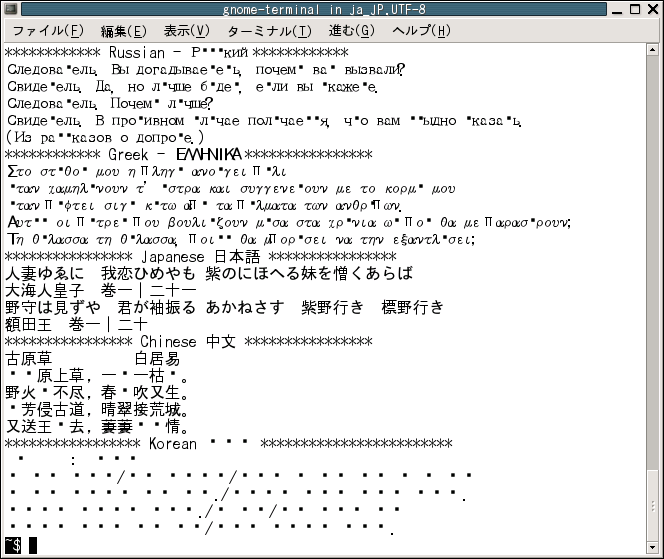
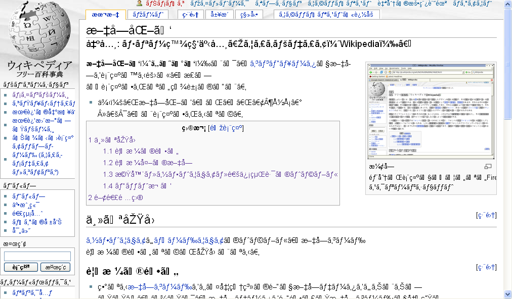

## Looking back

The implementation of a coding standard can make reviewing and collaborating on code much easier.

Understanding what different pieces of code look like at a glance is incredibly helpful, especially when you haven’t seen your old code in months even years. I recently had to go back and add new functionality to an old program I wrote, most of the time spent on that was trying to remember what everything did. Luckily it was written somewhat consistently. It initially started in one language and transitioned to another so it does have some oddities. It took a day of reviewing the code before I felt comfortable changing it which isn’t too bad but I was the only one who wrote any of it. If someone else had been thrown into the mix and I had to decipher their part which had been written to a different standard, it would probably add another day. This issue scales up with more people. Had it been a large team it would have taken many days to decipher all the different ways people code wasting a lot of time. If everyone follows a set coding standard it makes reviewing code much easier. That way you don’t have to waste time asking people “what is this?”.

## Mojibake 文字化け

Standards are important not only for people working close together but across an industry. The America Standard Code for Information Interchange(ASCII) was first introduced in 1963 and standardized how English would be displayed on computers. This is very early on in the development of the computer as such was adopted without much issue. Japanese on the other hand did not have a set standard for text encoding until 1997. This did not mean that there weren’t options for encoding Japanese before 1997 on contrary there were many. Unfortunately, not all were compatible with each other. This results in the incorrect display of text referred to as mojibake (文字化け) or “character changing”. Example below

Early on this did not cause many issues since systems were isolated for the most part. Problems would arise if companies had to share code with each other but it was not very overwhelming. 1984 Keio University and Tokyo Institute of Technology set up a phone line to connect their networks; this is the start the internet in Japan. Companies gradually become more interconnected and in the late 90’s Japanese citizens have easy access to home internet connections. This is when problems really begin to crop up. Navigating from site to site was a gamble if anything legible would be displayed due to the conflicting encoding standards. Companies hoping to work together find they can’t read documents that are being sent over. As such in 1997 text encoding is standardized under Japanese Industrial Standards (JIS). However, since Japanese text encoding was so fragmented this did not entirely fix the issue. 

**Simplified map of JIS encoding standards**

Incorporating Japanese into Unicode using JIS standards appears to have been the most successful. It worked by cutting down on the number of variant encoding standards that are present in JIS and instituted stricter definitions. Most of the headaches and fragmentation of encoding in Japan could have been avoided early on by instituting an industry wide standard. I realize that encoding Japanese is much harder than a Latin character set due to the multitude of unique characters that needs to be able to display. The reason Japanese companies felt the need to implement their own standards is a topic for a different day.

This encoding issue it is not specific to Japanese other languages that use non Latin scripts have similar problems and have their own names to go along with it.

## Takeaways

Having standards when working makes it easier to collaborate with others and for reviewing your own work. There is a reason standardization is so prevalent in the modern world since products are often not assembled by one person or country and it is often a group effort to bring a product or service to market.

## References: 

“Shift-JIS Encoding.” Encodings of Japanese, [https://www.sljfaq.org/afaq/encodings.html#encodings-Shift-JIS](https://www.sljfaq.org/afaq/encodings.html#encodings-Shift-JIS).

“Mojibake.” Wikipedia, Wikimedia Foundation, 7 Sept. 2021, [https://en.wikipedia.org/wiki/Mojibake](https://en.wikipedia.org/wiki/Mojibake).

“Jis Encoding.” Wikipedia, Wikimedia Foundation, 1 Feb. 2021, [https://en.wikipedia.org/wiki/JIS_encoding](https://en.wikipedia.org/wiki/JIS_encoding)

“Terminal Emulators.” What Is Mojibake? - Terminal Emulators, [http://www8.plala.or.jp/tkubota1/mojibake/terminal-emulators-200011.html](http://www8.plala.or.jp/tkubota1/mojibake/terminal-emulators-200307.html)

