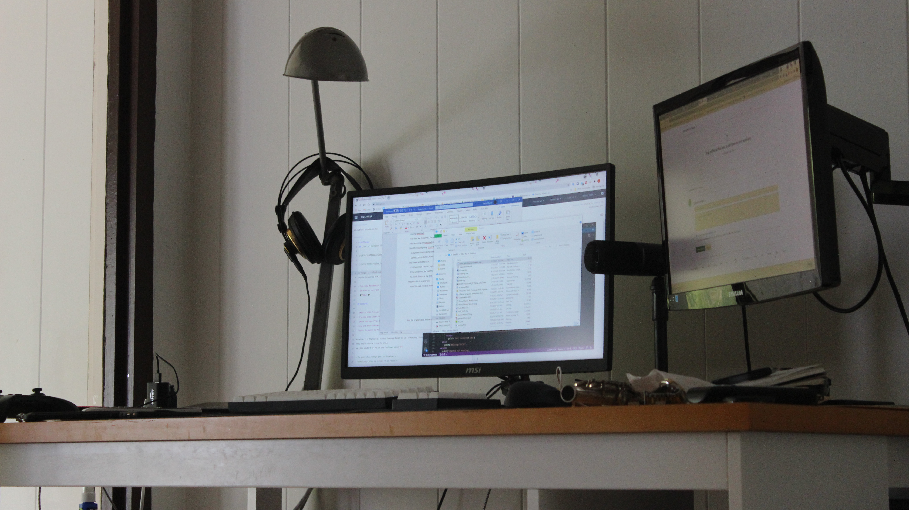
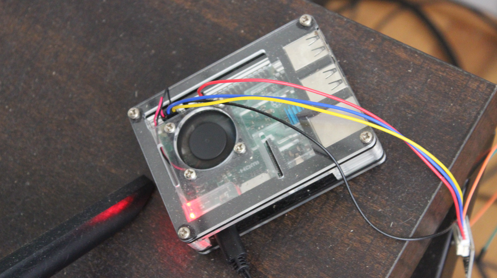

<div class="ui small rounded images">
  
  
</div>

Through various sales on Amazon, I had a smartplug and echodot. To control everything a raspberry pi 3 running openHAB.

1.  **Connect the smart plug to the echo using the provided app.** Link to download Alexa in the playstore [Alexa](https://play.google.com/store/apps/details?id=com.amazon.dee.app&hl=en_US&gl=US)
  
2.  **Setup an openHAB server on the pi.** Setup instructions [https://ubuntu.com/appliance/openhab/raspberry-pi](https://ubuntu.com/appliance/openhab/raspberry-pi)

3.  **Configuring openHAB.**
  
	Install the Amazon Echo control binding through openHAB.
	Connect to the Echo API and authorize openHAB and then search for connected devices.
	Select the device for automation and note the name.

4. **Write the code.**

	On the pi itself I made a python script to see if I was at my desk and then if was past a 
	certain hour. If the conditions are met the light turns on and when they aren’t it turns off.
	When the light is to be turned on you can send a command to openHAB to pass on to Alexa as following
```py
headers = {
    'Content-Type': 'text/plain',
    'Accept': 'application/json',
}
data = 'ON'
setState = requests.post('http://"Your IP":8080/rest/items/AlexaGuardonFirstplug_PowerState', headers=headers, data=data)
   ```
    To check if I was at my desk I have the script ping my desktop and see if its on.
```py
response = os.system("ping -c 3 " + hostname)
```

5. **Set it up and test.**

	Have the code run as a service on the pi so it starts automatically
    
 
 
 I have also added a temperature sensor to the pi and hope to implement a function that will flash the light and use alexa to announce the temperature.


Repository is here [https://github.com/hbzxc/AutoHome](https://github.com/hbzxc/AutoHome).


