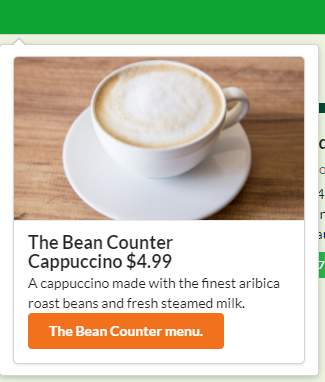

Bow Bites is a website that allows students to quickly and easily find a place to eat, including finding places that offer a specific type of food, places that are currently open, and to be able to see the menus.

There are three levels of access to the site:

 - Users, who can log in establish and sort by their food preferences
 - Users, who can log in establish and sort by their food preferences
 - Vendors, who can log in to modify their profiles and set their menus

Admins, who can log in to add and delete vendors, and administrate the system.

Users will be able to see a page where food is recommended to them. Users can then establish their preferences and exclude food they dislike.

Users have the option to like specific vendors and add them to their profile page where they are easily accessible.

More specifics and pictures here: [bow-bites.github.io](https://bow-bites.github.io/)

Code Here: [https://github.com/bow-bites/bow-bites](https://github.com/bow-bites/bow-bites)

Site can be viewed Here: [bowbites.xyz](https://bowbites.xyz/#/)

This was a collaborative project between Alexander Jones [https://acjones8.github.io](https://acjones8.github.io/), Cole Amparo [https://coleamparo.github.io/](https://coleamparo.github.io/) and I.

## What I did

For this project I worked on all the backend for storing vendors, menu items, and user profiles.

I also made the user profile and add vendor pages. I implemented the favorite, unfavorite, delete vendor buttons as well as the tag showing If restaurants are open or not based on the current time. I also added the pick for me option which randomly choose an option for you based on the search criteria.

### Backend Stuff

There were only two collections for this project one which held the vendors and menu items and the other which kept track of which vendors a specific user has liked.

That hardest part about the vendor collection was figuring out how [uniforms](https://uniforms.tools/) was storing the vendor with the menu items to the db (It was an object which contained an object array). After that it was easy to pull and manipulate the data.

For the liked user collection, it stores the users ID alongside an array of vendor IDs which correspond to what is liked.

Not too much going on.

### Front end

Mostly uses [semantic UI](https://semantic-ui.com/) to style most of the page, make buttons, dropdowns, color changes. There is some specific styling on the pages to adjust the margins and tweak the color of things to match but it is mostly semantic UI. It was great to be able to make a drop down menu quickly especially when making the filter on the favorites page.

The Pick for me button is my favorite feature. Whenever I ask people where they want to eat I often hear “anything” or “I don’t know” so this is a great feature for me. Using the scroll wheel to have it randomize was initially not a planed feature but I forgot to pass it as a reference when I set everything up and now whenever anything renders it will also randomize. It wasn’t intended but I liked the effect so I didn’t fix it and it is now a feature.

## Working as a Group

Everything was done through GitHub. Alex, Cole and I met weekly to discuss changes and go over what needed to be done. It was also typically when we merged all our code and deployed it to our server on [digital ocean](https://www.digitalocean.com/products/droplets/).

## Testing

This was my favorite part. I enjoyed being able to push a button and see it go. Using [test café](https://testcafe.io/) was incredibly easy to set up and use. It saved hours of my time going through testing the add vendor part of the site since I didn’t need to type out each vendors information and menu.

## Deployment

As mentioned earlier this was deployed on digital ocean servers running meteor.

This is the first time I ever purchased a domain name. I didn’t know they could be so cheap.
