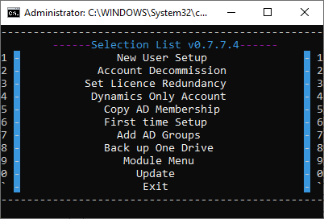
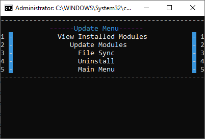

I created a tool for onboarding new hires and departing existing users. It will create and update attributes from the local Active Directory and Azure Active Directory.
In addition to this it can also backup a users onedrive to an external location.

**_RunAccount.bat**

Checks if an admin credential has been saved, if not prompt to set one up

Display the options menu

Go to the selected option and loop

## New user setup 
**Options**

This will call the New AD user_form_grab.ps1 which in turn takes its functions from NewUserModules.psm1.

In New AD user_form_grab.ps1 the security groups are defined and can be changed.

$DefaultPass set the default password

$UserFolderLocation the default folder locations to be created for the user

$SomeCompanyFolderLocation default folder locations to be created for SomeCompan users

**How to use**

Users must be submitted through a ms forms link

After the new user is submitted an email will be sent to the submitter with the entry ID.

The information is saved to an excel sheet in the company one drive

The scrip will attempt to sync to the sheet by opening and closing the file.

An ID prompt will then be given. Enter what was emailed.

It will ask if you want to check the license inventory and will display the currently available licenses

If the licenses are out I will direct you to the license admin page where it can be updated.

This process could be automated, but I thought it best left to human review.

A prompt requesting a username for the user will come up. Enter the new username

The scrip will start creating the accounts and assigning the appropriate licenses.

Might take a while even though it does send a sync command to the server.

Then its location in AD will be determined from the next two prompts. Location and Division

If a laptop is already set aside, you can enter it and it’ll be included on the generated hire checklist.

Same with the fob

It will then ask if the user wants to add the user to set ad group membership defaults for accounting, engineering and construction are currently setup. This will then assign the default group membership to the account.

During this step it will also create all the default folders i.e. scans, home, documents on the appropriate server and set permissions on it. This is based off the office location and what company was selected.

Final steps check if the ad account is synced to azure and is licensed

Export a new hire sheet to the new hire sheets folder

## Account Decommission

**Options in Block account.ps1**

$EmailList the domains that we have. Used to check if there is an account in azure.

$BackupLoc the location to create the backup folder

**How to use**

Prompt will appear asking for the user to be decommissioned

Start time will be stamped to the log

-checks if the user exists in ad, if not stop

-moves it to the appropriate OU

-sets the description to disabled

-hide from the global address list

-record group membership and export it to the log and csv

-remove groups

-disables the user

One drive files will then be backed up to a server

-file structure is copied to a temp file

-after its done the structure is used copy each folder to the backup location.

CheckAll will check all the emails to see if there is an associated user account and if so, remove it

-Disable active sync

-Disable OWA

-Hide from global address list

-Set to shared

-Disable account

-Copy ad groups to log

-Remove from groups

-Remove associated licenses

Stamps end time

**Set License Redundancy**

If the license did not get set this can be run to set the license.

This function is obsolete, problem seems to have been solved within new user setup

This is a backup

**Dynamics Only Account**

Creates a dynamics only account does not use the forms submission

Manual entry of name and username

**Copy AD Membership**

Will copy the ad group membership from one account to another

Two prompts one for the account to copy and the target user.

**First time Setup**

Installs azure and msoline modules to access online services

Stores password as .cred file and username

Installs AD if not already installed

**Add AD Groups**

Will run the add ad groups function for the last user setup which is stored in the support files folder as UPN.txt<![endif]-->

**_RunAccount.bat**

Checks if an admin credential has been saved, if not prompt to set one up

Display the options menu

Go to the selected option and loop

## New user setup

**Options**

This will call the New AD user_form_grab.ps1 which in turn takes its functions from NewUserModules.psm1.

In New AD user_form_grab.ps1 the security groups are defined and can be changed.

$DefaultPass set the default password

$UserFolderLocation the default folder locations to be created for the user

$SomeCompanyFolderLocation default folder locations to be created for SomeCompany users

**How to use**

Users must be submitted through a ms forms link

After the new user is submitted an email will be sent to the submitter with the entry ID.

The information is saved to an excel sheet in the company one drive

The scrip will attempt to sync to the sheet by opening and closing the file.

An ID prompt will then be given. Enter what was emailed.

It will ask if you want to check the license inventory and will display the currently available licenses

If the licenses are out I will direct you to the license admin page where it can be updated.

This process could be automated, but I thought it best left to human review.

A prompt requesting a username for the user will come up. Enter the new username

The scrip will start creating the accounts and assigning the appropriate licenses.

Might take a while even though it does send a sync command to the server.

Then its location in AD will be determined from the next two prompts. Location and Division

If a laptop is already set aside, you can enter it and it’ll be included on the generated hire checklist.

Same with the fob

It will then ask if the user wants to add the user to set ad group membership defaults for accounting, engineering and construction are currently setup. This will then assign the default group membership to the account.

During this step it will also create all the default folders i.e. scans, home, documents on the appropriate server and set permissions on it. This is based off the office location and what company was selected.

Final steps check if the ad account is synced to azure and is licensed

Export a new hire sheet to the new hire sheets folder

**Account Decommission**

**Options in Block account.ps1**

$EmailList the domains that we have. Used to check if there is an account in azure.

$BackupLoc the location to create the backup folder

**How to use**

Prompt will appear asking for the user to be decommissioned

Start time will be stamped to the log

-checks if the user exists in ad, if not stop

-moves it to the appropriate OU

-sets the description to disabled

-hide from the global address list

-record group membership and export it to the log and csv

-remove groups

-disables the user

One drive files will then be backed up to a server

-file structure is copied to a temp file

-after its done the structure is used copy each folder to the backup location.

CheckAll will check all the emails to see if there is an associated user account and if so, remove it

-Disable active sync

-Disable OWA

-Hide from global address list

-Set to shared

-Disable account

-Copy ad groups to log

-Remove from groups

-Remove associated licenses

Stamps end time

**Set License Redundancy**

If the license did not get set this can be run to set the license.

This function is obsolete, problem seems to have been solved within new user setup

This is a backup

**Dynamics Only Account**

Creates a dynamics only account does not use the forms submission

Manual entry of name and username

**Copy AD Membership**

Will copy the ad group membership from one account to another

Two prompts one for the account to copy and the target user.

**First time Setup**

Installs azure and msoline modules to access online services

Stores password as .cred file and username

Installs AD if not already installed

**Add AD Groups**

Will run the add ad groups function for the last user setup which is stored in the support files folder as UPN.txt

## Module/Update Menu

**View Installed Modules**
Shows which modules are installed

**Update Modules**
Will update any modules listed in the PSModules.txt

**File Sync**
Will update all logs from the server and save recent files to the server based off of last edit time

**Uninstall**
Removes all modules listed in the PSModules.txt as well as RSAT.txt

I removed everything company specific from the scrips and swapped them with temporary names like "Company" or "SomeOtherComapny" 
Source: [https://github.com/hbzxc/UserSetup-Breakdown](https://github.com/hbzxc/UserSetup-Breakdown)
