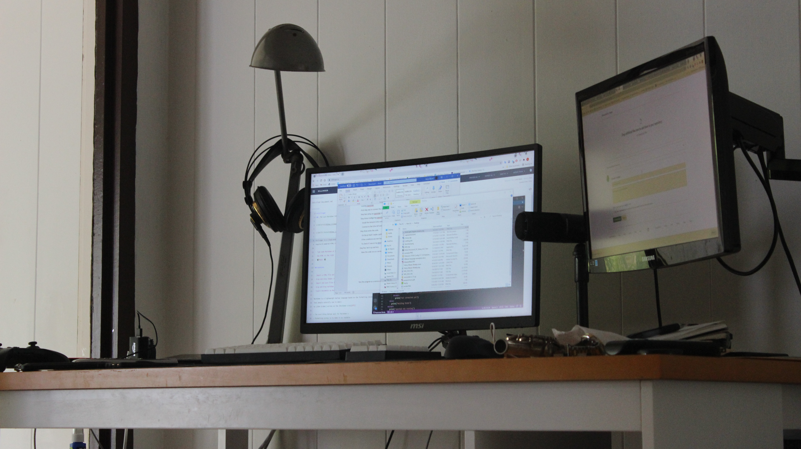
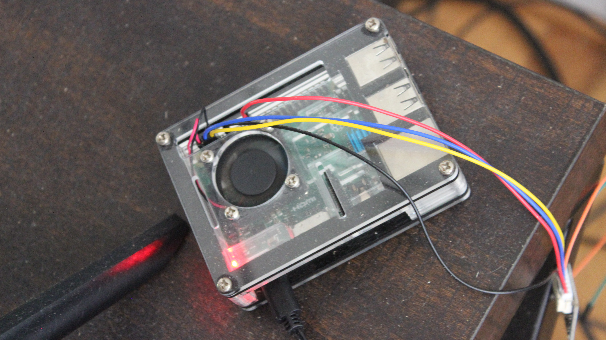

  
  

Through various sales on Amazon, I had a smartplug and echodot. To control everything a raspberry pi 3 running openHAB.
## First step was to connect the smart plug to the echo using the provided app.
## Step two setup an openHAB server on the pi.
## Step three Configuring openHAB. 
    Install the Amazon Echo control binding through openHAB
    Connect to the Echo API and authorize openHAB and then search for connected devices
## Step three write the code.
    On the pi itself I made a python script to see if I was at my desk and then if was past a certain hour.
    If the conditions are met the light turns on and when they aren’t it turns off.
    To check if I was at my desk I have the script ping my desktop and see if its on.
## Step four Set it up and test.
    Have the code run as a service on the pi so it start automatically
    
 

Repository is here [https://github.com/hbzxc/AutoHome](https://github.com/hbzxc/AutoHome).

